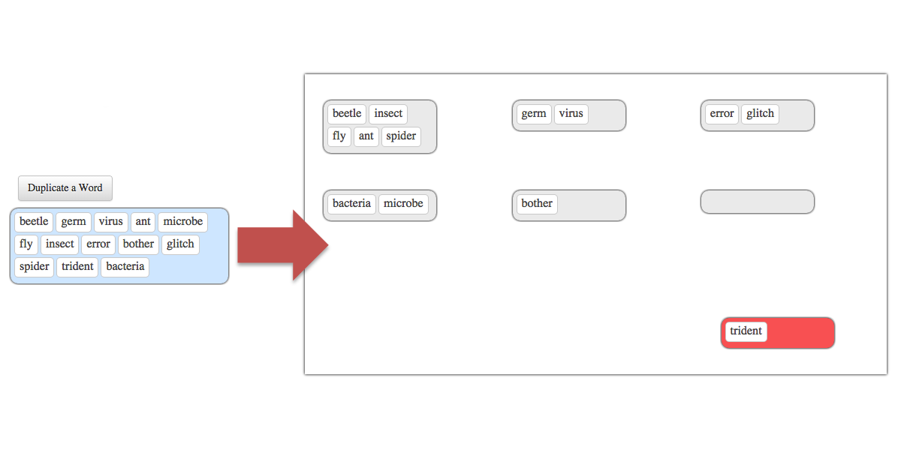
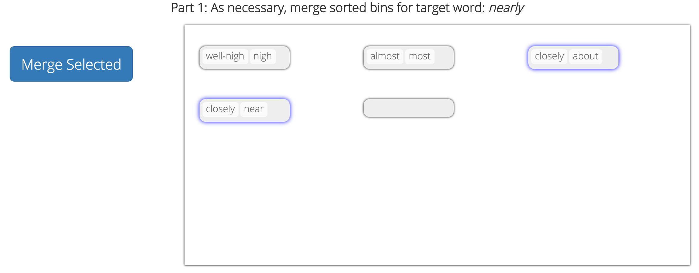

# crowd_cluster
This is a set of scripts that will run an iterative crowd clustering test on the [Amazon Mechanical Turk Sandbox](https://requestersandbox.mturk.com/). It is potentially useful in cases where you have a large number of things to sort - too many for any one person to do in one sitting - and want to (a) divide the sorting task, and (b) get some consensus on the right sorting solution.

We used this HIT to produce a set of crowd-clustered paraphrases for evaluation in the paper, 'Clustering Paraphrases by Word Sense'. 

If you use this HIT in your work, please cite the following paper:

```python
@article{CocosAndCallisonBurch-2016:NAACL:ParaphraseClustering, 
  author =  {Anne Cocos and Chris Callison-Burch},
  title =   {Clustering Paraphrases by Word Sense},
  booktitle = {Proceedings of the 15th Annual Conference of the North American Chapter of the Association for Computational Linguistics: Human Language Technologies (NAACL 2016)},
  month     = {June},
  year      = {2016},
  address   = {San Diego, California},
  publisher = {Association for Computational Linguistics}
}
```
## The HIT
This HIT presents workers with paraphrases of a **target** word and enables workers to sort the paraphrases by the sense of the **target** they convey.

It is meant to be run in an iterative fashion, meaning that after each round, workers' sorting results are processed and the next round starts off using the results of the previous round. 



### Optional Merge Phase

There is also an option for workers to begin each round with a merge phase, in which they can combine buckets from the previous round containing words meaning the same thing.



### Iterative clustering

This HIT runs iterations of `(merge ->) sort -> update` until all target words have been clustered by the specified number of workers, to the specified level of agreement. There is some manual work to be done; before each round, you must upload a `.csv` file containing the next round's HIT data to AMT, and after each round, you must download the results `.csv` file and run an `update` script to generate the next batch.

## Contents

An overview of the files in this repo and what each does:

| File/Directory        | Description |
| ------------- |:-------------| 
| `readme.md`   | This readme doc |
| `settings.py` | Contains AMT account settings, and other HIT settings, such as the number of workers that must sort each word, the agreement threshold, etc. See comments in file for details. |
| `setup` | A script to set up the initial clustering batch |
| `update` | Iterative update script, to be run between clustering rounds |
| `reset` | Will erase HIT data and reset directory structure |
| `datasetup.py` | Initial data setup, run by `setup`. Generates paraphrase set files to record HIT results and worker record file to track worker accuracy. |
| `create_batch.py` | Run by `setup` and `update`. Creates a clustering batch for each sort round. |
| `process_results_noseed` | Run by `update`. Compiles and merges worker sorting solutions after each sort round. |
| `paraphrase.py` | Helper functions for other scripts. |
| `hit_data/boguslist` | List of words that can be suggested as the 'bogus' word in each round, to assess worker accuracy. |
| `hit_data/pp/` | Contains two important files for setting up the HIT. The first is a target list (example included is `semeval_tgtlist_rand80`), which contains the target words with part of speech to be sorted, one per line. The second is the paraphrase set file, which gives the *unsorted* list of paraphrases for target words (example included is `semeval_tgtlist_rand80_multiword_xxl_PPDB2.0Score.ppsets`). The paraphrase scores given in the later file are ignored by this crowd clustering HIT. |
| `hit_data/gold/` | Optionally, you may begin the HIT by seeding the first round from a set of gold standard clusters. An example of the gold file format is given here in (`semeval_tgtlist_rand80.wngold`). |
| `hit_data/batch` | Will contain batch `.csv` files for upload to AMT. |
| `hit_data/json` | Will contain a `.json` file for each target, recording the results of each clustering round.|
| `hit_data/results` | When you finish a clustering round on AMT, you should download the results `.csv` file and place it in this directory before running `update`. |
| `hit_data/workerjson` | Will contain a `.json` file to track worker accuracy. |
| `web/{merge|nomerge}/` | There are two options for this HIT: You may include a merge phase after each sorting round, or not. This directory contains the actual HIT html/javascript/css files for each case. You can view the HIT by opening the `index.html` file, but for using the HIT on AMT, you should copy and paste the contents of the `finalHIT.html` file to the AMT HIT GUI. (The `finalHIT.html` file combines the HTML, CSS, and JavaScript from the stand-alone files, and removes headers that cause trouble in AMT.) |


## Getting Started

### Step 1. Gather your data.

Place your list of target words to be sorted, and the file containing unsorted paraphrase sets, in the `hit_data/pp` directory. See the current contents for examples.

Optionally, you may seed the first sort round of the HIT using a set of gold standard clusters. To do this, place your gold standard cluster file in the `hit_data/gold` directory. See the current contents for an example.

### Step 2. Update the settings.

In order to actually run the HIT on AMT, you need to update the `settings.py` file with your own AMT credentials. 

Importantly, you should also update these settings as appropriate:

`REDUNDANCY`: The number of workers you need to cluster each target word before processing the results. NOTE: This should be the same as the number of workers you assign to each HIT in AMT.

`CLUSTER_AGR_THRESHOLD`: The percentage of workers who must agree on a paraphrase's placement before adding it to a gold cluster

`MERGE_THRESHOLD`: The percentage of workers who must agree to merge two clusters


### Step 3. Initialize
To initialize the clustering data, run

`./setup`

This will initialize a set of json files in the `hit_data/json` directory, a worker log, and a scores log. It will also create the first batch .csv file under `hit_data/batch` which you can upload to AMT to start the first round of iterative clustering. If you've replaced the example target and paraphrase set files with your own, update this script with the new ones.

As it creates the batch, it will ask questions like:

`Bogus for mad: ginger. OK? (y/n)`

This is because we throw 'bogus' (non-paraphrase) words into each round as a quality control measure, and we need to make sure the control words used are in fact not paraphrases of the **target** term. Just click `y` or `n` to accept/reject each one.


### Step 4,5,... Iterate
Once you or your workers have completed all available HITs, download the `Batch_XXXXXX_batch_results.csv` file from AMT to the `hit_data/results` directory and run:

`./update`

This will process the results from your last round of HITs and create a new batch file in the `hit_data/batch` directory. Just upload this new batch file to AMT and you're on round 2.

Once your workers have finished clustering all words, running `./update` will let you know that you've finished. Now pay your workers and admire their handiwork.

## Reset
You can reset all directories and files to their initial state with

`./reset`

## Contact
If you have any questions, comments, complaints, or really anything to say about this HIT, I'm happy to hear from you. Please contact me at `acocos@seas.upenn.edu`.
